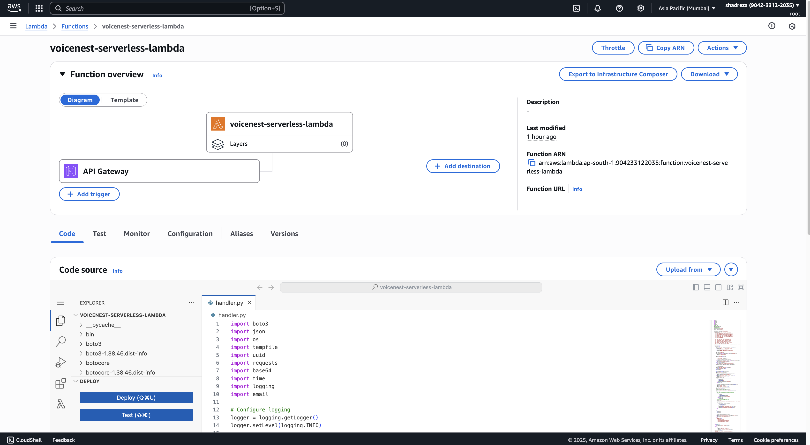
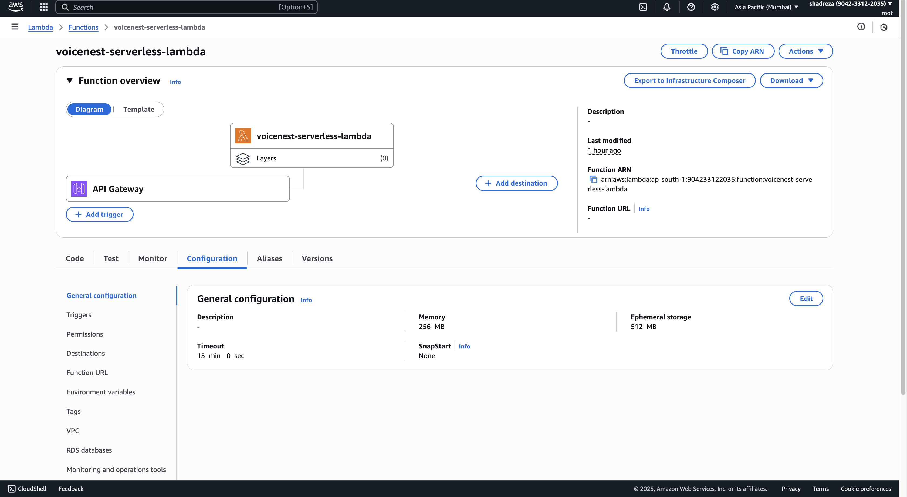
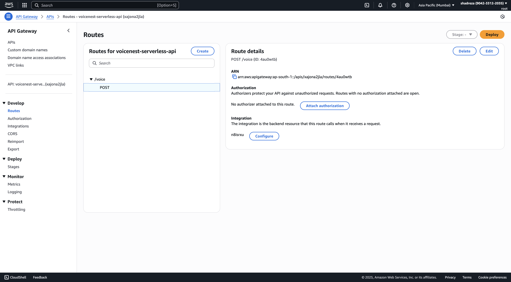
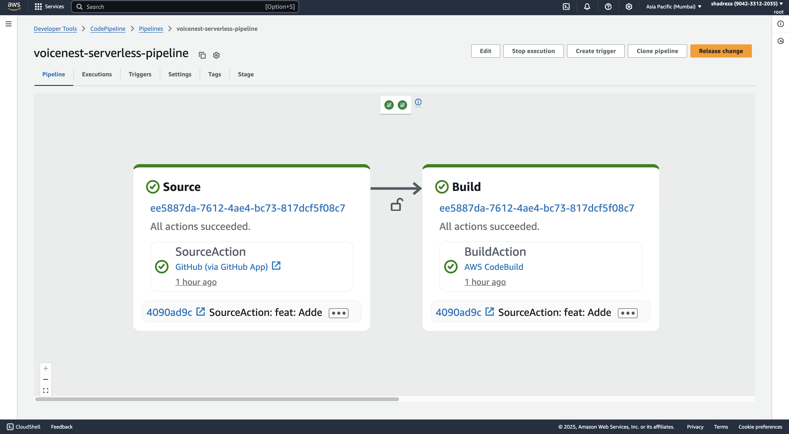
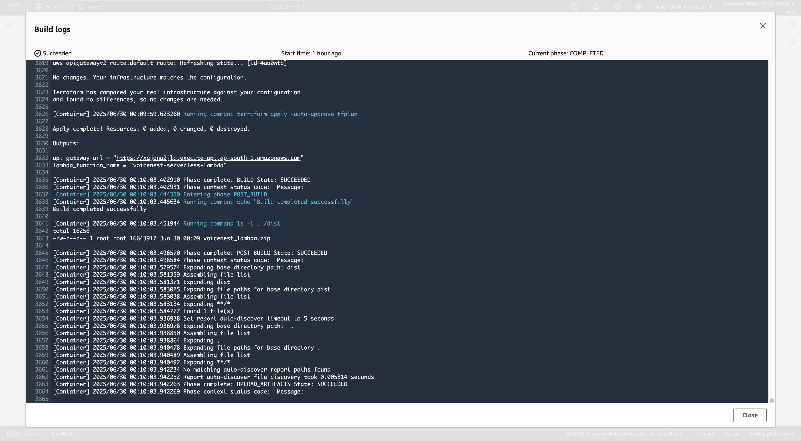

# ☁️ VoiceNest Serverless — Backend for the VoiceNest App

> **Scalable serverless infrastructure for AI-powered voice companionship.**
>
> This backend system powers [VoiceNest](https://voicenest-app.vercel.app), a multilingual, empathetic voice assistant for the elderly — built using AWS Lambda, Terraform, and a suite of AWS AI services.

---

## 📖 About the Project

**VoiceNest** addresses a growing issue of **digital loneliness** among elderly individuals. Many find it difficult to use modern technology, yet they crave connection. Our inspiration came from a desire to make empathetic, AI-driven conversations accessible through **nothing more than the human voice** — no apps, no typing.

This backend repository implements the **serverless engine** behind VoiceNest. Using **AWS Lambda as the core compute layer**, it processes voice input, understands emotions, and generates spoken responses in over 40 languages — providing companionship through natural conversation.

Built from scratch during the AWS Lambda Hackathon 2025, the infrastructure and Lambda logic were fully developed during the submission period. The frontend for this project can be found [here](https://github.com/shadreza/voicenest-app).

---

## 💠 Tech Stack

### 🧑‍💻 Languages & Frameworks

* **Python** — Lambda backend logic
* **Terraform (HCL)** — Infrastructure as Code
* **Bash** — Deployment scripting

### ☁️ Cloud Services (AWS)

* **AWS Lambda** — Core compute and orchestration
* **API Gateway** — RESTful interface for frontend-to-backend communication
* **Amazon S3** — Stores audio and deployment artifacts
* **Amazon DynamoDB** — State locking for Terraform
* **IAM** — Secure role and policy enforcement
* **SSM Parameter Store** — Secure environment variable storage
* **CodePipeline + CodeBuild** — Continuous Integration & Deployment

### 🧠 AI & NLP Services

* **Amazon Transcribe** — Converts voice to text
* **Amazon Comprehend** — Detects language and sentiment
* **Amazon Translate** — Multilingual support
* **Amazon Polly** — Converts text to natural speech
* **Cohere (`command-r-plus`)** — Empathetic AI-generated responses

---

## 🧱 Infrastructure Components (Provisioned via Terraform)

* ✅ S3 buckets (Terraform state, audio storage, Lambda artifacts)
* ✅ DynamoDB table (Terraform state locking)
* ✅ IAM roles and permissions for Lambda & CI/CD
* ✅ API Gateway (voice endpoint) + Lambda function
* ✅ CodePipeline & CodeBuild for automated deployment

---

## 🧠 Lambda Function Overview

The `handler.py` Lambda function orchestrates a multilingual AI pipeline:

1. 🎹 Receives audio via API Gateway (form-data)
2. 📝 Transcribes audio using **Amazon Transcribe**
3. 🌍 Detects spoken language and sentiment with **Comprehend**
4. 🌐 Translates non-English input to English (if needed)
5. 🤖 Generates response using **Cohere** LLM
6. 🌐 Translates AI response back to the user's native language
7. 🔊 Synthesizes the reply with **Amazon Polly** (fallback to English if unsupported)

This entire process runs within a single, cost-efficient Lambda execution.

---

## 🚀 CI/CD Deployment Flow

1. ✅ Code pushed to `master` branch
2. ↺ Triggers **AWS CodePipeline**
3. 💠 **CodeBuild**:

   * Packages Lambda source into a zip
   * Uploads artifacts to S3
   * Pulls secrets/config from SSM
   * Runs `terraform apply`
4. 📦 Lambda and infrastructure are deployed/updated seamlessly

---

## 📁 Project Structure

```
.
├── infra/                     # Terraform configs
│   ├── main.tf
│   └── lambda_env_vars.tf.json
│
├── lambdas/
│   └── voicenest_serverless/
│       ├── handler.py         # Main Lambda logic
│       └── requirements.txt
│
├── scripts/
│   ├── package_lambdas.sh     # Lambda packaging script
│   └── generate_lambda_env_vars_from_ssm.py
│
├── dist/                      # Lambda build artifacts
└── buildspec.yml              # CodeBuild config
```

---

## 🔌 API Contract

**POST** `${API_GATEWAY_URL}/voice`

* **Headers**: `Content-Type: multipart/form-data`
* **Body**: `audio` file (WAV, MP3, WebM, OGG)
* **Returns**: `audio/mpeg` stream (Base64 encoded), with `x-language` header indicating response language

---

## 🌍 Language Support

| Feature       | Technology        | Notes                           |
| ------------- | ----------------- | ------------------------------- |
| Transcription | Amazon Transcribe | Auto-detects spoken language    |
| Translation   | Amazon Translate  | 40+ languages supported         |
| Voice Output  | Amazon Polly      | Falls back to English if needed |

---

## 📸 Architecture & Screenshots

### 🎛️ Overall Infrastructure


### 🐍 Lambda Function Code & Config




### 🌐 API Gateway Integration



### ↺ CI/CD: CodePipeline + CodeBuild




---

## 📥 Setup & Deployment Guide

### 1. Clone the Repository

```bash
git clone https://github.com/shadreza/voicenest-serverless.git
cd voicenest-serverless
```

### 2. Install Terraform

```bash
brew install terraform
```

### 3. Configure AWS Credentials

```bash
aws configure
```

### 4. Configure Terraform Backend

Edit your `main.tf`:

```hcl
terraform {
  backend "s3" {
    bucket         = "voicenest-serverless-tf-state"
    key            = "tf-infra/terraform.tfstate"
    region         = "ap-south-1"
    dynamodb_table = "voicenest-serverless-tf-state-locking"
    encrypt        = true
  }
}
```

### 5. Deploy the Infrastructure

```bash
scripts/package_lambdas.sh
cd infra
terraform init
terraform apply -auto-approve
```

---

## 🏁 Hackathon Compliance: AWS Lambda Usage

VoiceNest fulfills the core criteria for the AWS Lambda Hackathon:

* ✅ **Lambda as the core compute service** — orchestrates AI workflows
* ✅ **Trigger via API Gateway** — listens for frontend voice submissions
* ✅ **Multiple AWS integrations** — including Transcribe, Translate, Polly, Comprehend, S3, CodePipeline, and more
* ✅ **Fully Serverless** — cost-efficient and production-ready

All backend logic and infrastructure were developed entirely within the hackathon window.

---

## 👤 Author

**Muhammad Shad Reza**
🌐 [LinkedIn](https://linkedin.com/in/shadreza100) • 💠 [GitHub](https://github.com/shadreza)

---

> 💜 Built with care for those who just want someone to talk to.
