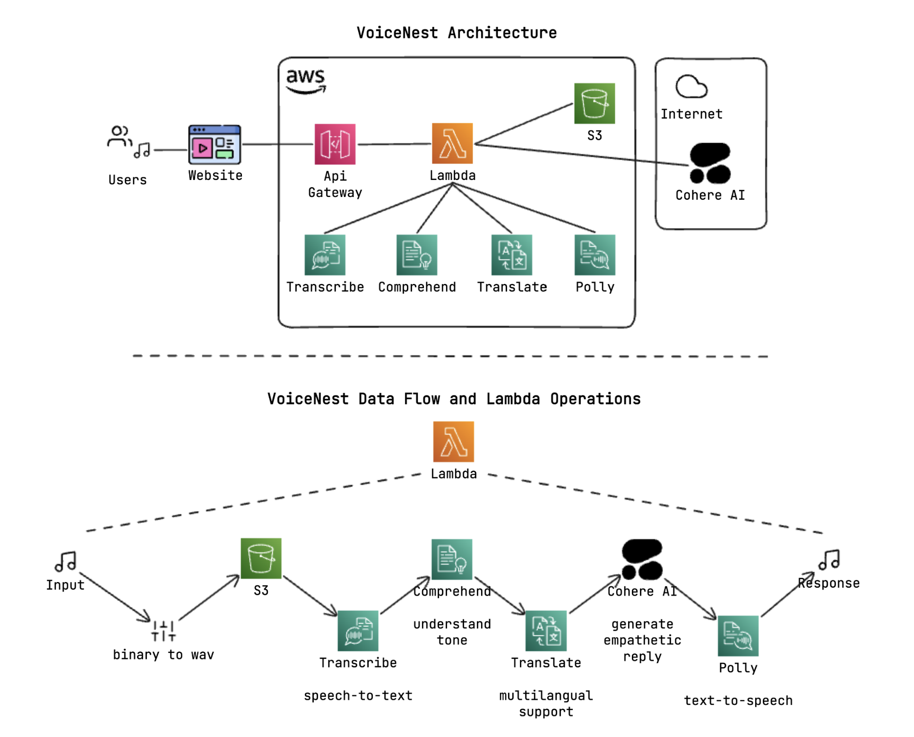

# ☁️ VoiceNest Serverless (Backend Infrastructure & Lambda)

> **Serverless Backbone of the VoiceNest App**
>
> Terraform-powered AWS infrastructure & AI-driven Lambda function that brings empathetic conversations to life.

---

## 📦 Overview

This repository contains the **infrastructure as code (IaC)** and **Lambda codebase** for [VoiceNest](https://voicenest-app.vercel.app), an AI-powered, multilingual voice companion built with AWS services.

---

## ⚙️ Stack

* **Infrastructure**: Terraform (modular)
* **Cloud Provider**: AWS
* **Runtime**: AWS Lambda (Python 3.12)
* **AI & NLP**: Cohere, Amazon Transcribe, Polly, Comprehend, Translate
* **CI/CD**: AWS CodePipeline + CodeBuild

---

## 🧱 Infrastructure Components

### 🗂️ Provisioned Resources (via Terraform)

* ✅ S3 buckets (for TF state, audio uploads, Lambda artifacts)
* ✅ DynamoDB (Terraform state locking)
* ✅ IAM roles and policies for Lambda, CodeBuild, CodePipeline
* ✅ Lambda function & API Gateway
* ✅ CodePipeline (source: GitHub → build → deploy)

---

## 🧠 Lambda Features

* 📥 Accepts audio (WAV, MP3, WebM, OGG) via `multipart/form-data`
* 🔊 Transcribes voice input using **Amazon Transcribe**
* 🌍 Detects spoken language using **Comprehend**
* 🌐 Translates non-English input to English using **Translate**
* 💬 Analyzes sentiment of the input
* 🤖 Generates AI reply with **Cohere's command-r-plus** model
* 🌐 Translates AI reply back to user's language (if supported)
* 🔁 Synthesizes speech reply via **Amazon Polly** in original language (fallback to English)

---

## 🚀 Deployment Flow

1. ✅ Push to `master` branch
2. 🔄 CodePipeline triggers
3. 🏗️ CodeBuild:

   * Packages Lambda code
   * Uploads zip to S3
   * Writes env vars from SSM to `lambda_env_vars.tf.json`
   * Applies Terraform infrastructure
4. 🔁 Lambda updated & deployed via Terraform

---

## 📁 Project Structure

```
.
├── infra/                  # Terraform configurations
│   ├── main.tf
│   └── lambda_env_vars.tf.json
│
├── lambdas/
│   └── voicenest_serverless/
│       ├── handler.py      # Main Lambda logic
│       └── requirements.txt
│
├── scripts/
│   ├── package_lambdas.sh  # Lambda packaging & deployment
│   └── generate_lambda_env_vars_from_ssm.py
│
├── dist/                   # Lambda build artifacts
└── buildspec.yml           # CodeBuild instructions
```

---

## 🌐 API Contract

**POST** `${API_GATEWAY_URL}/voice`

* **Headers**: `Content-Type: multipart/form-data`
* **Body**: `audio` file (WAV/MP3/WEBM)
* **Returns**: `audio/mpeg` (Base64), with `x-language` header

---

## 🌍 Language Support

* 🔤 Transcription: Auto-detected via Amazon Transcribe
* 🌐 Translation: 40+ languages supported
* 🗣️ Text-to-speech: Amazon Polly (fallback to English if not supported)

---

## 🛠️ Infrastructure Snapshots

### 🧩 Overall Architecture & Components



---

### 🐍 Lambda Function (Code & Configuration)

#### 🧠 Source Code (handler.py + Dependencies)


#### ⚙️ Runtime Config & Environment


---

### 🌐 API Gateway: Voice Endpoint Integration

#### 🔗 Route: `POST /voice` → Lambda


---

### 🔄 CI/CD Pipeline: GitHub → Build → Deploy

#### 📦 CodePipeline: Full Deployment Flow


#### 🔧 CodeBuild: Lambda Packaging & Terraform


---

## 📥 Setup Instructions

### 1. Clone

```bash
git clone https://github.com/shadreza/voicenest-serverless.git
cd voicenest-serverless
```

### 2. Install Terraform

```bash
brew install terraform
```

### 3. Configure AWS

```bash
aws configure
```

### 4. Bootstrap S3 + DynamoDB for Terraform backend

```hcl
terraform {
  backend "s3" {
    bucket         = "voicenest-serverless-tf-state"
    key            = "tf-infra/terraform.tfstate"
    region         = "ap-south-1"
    dynamodb_table = "voicenest-serverless-tf-state-locking"
    encrypt        = true
  }
}
```

### 5. Deploy

```bash
scripts/package_lambdas.sh
cd infra
terraform init
terraform apply -auto-approve
```

---

## 👨‍💻 Author

**Muhammad Shad Reza**
🌐 [LinkedIn](https://linkedin.com/in/shadreza100) • 🛠️ [GitHub](https://github.com/shadreza)
